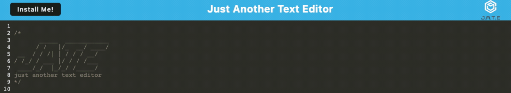

# Homework 19 - Text Editor

## Description

This is a text editor that runs in the browser. It is a single page application that meets PWA criteria, meaning this application is built with data persistence mechanisms and will run both with and without an internet connection.

When a user types text on the page, the data is saved to a local database. An install button makes the application available for download on a user's local machine. This allows the application to run and store data offline.

## Installation

This application requires a package called "idb".

This application was deployed to Heroku.

## Screenshot

## License

This application is covered under an MIT License.

## Contact Me

GitHub: https://github.com/heatherveva

Email: heatherveva@gmail.com

## Links

GitHub Repository: https://github.com/heatherveva/hw19_texteditor.git

GitHub Page: https://heatherveva.github.io/hw19_texteditor/

Heroku: https://textedit-heather-app.herokuapp.com/
